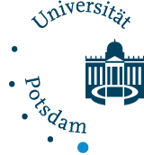

	

The priority research area **Evolutionary Systems Biology** at the University
of Potsdam acts at the interface between **evolutionary biology** and 
**systems biology** – two well-established disciplines in biology.

## Conceptual connections

While **evolutionary biology** focuses on understanding how heritable traits
 change in populations due to mutation, natural selection, drift and migration,
   **systems biology** aims at understanding how interactions of cellular
   components within biological systems lead to emergent properties over the
   lifespan of a single individual. Therefore, both disciplines aim to
   uncover the genetic and molecular basis of phenotypes, albeit at different
   scales (Figure 1).

## Methodological connections

Both **evolutionary biology** and **systems biology** are firmly grounded
in mathematical modelling and development of theories, resulting in novel
cutting-edge computational approaches. These computational approaches use
the plethora of data obtained from genotyping technologies, to survey genetic
variation, and from various molecular and cellular profiling technologies,
to monitor the diverse cellular components.

	

##### Conceptual and methodological connections between evolutionary biology and systems biology:

 Mutations, natural selection, and genetic drift shape the distribution of alleles in a population. 
The Hardy-Weinberg law, a seminal theoretical result in evolutionary biology, states that in absense of 
these driving forces and without migration the genotype and allele frequences in a population remain constant. 
Systems biology focuses on cellular networks in an individual by employing phenotyping technologies 
across different temporal and spacial scales.

## News
The page has been started!

## Acknowledgement

<table>
<tr>
<td>
  
</td>
<td>&nbsp;</td>
<td>

<a href="/en/ibb/" title="to the homepage of Institute of Biochemistry and Biology">
   
		Institute of Biochemistry and Biology
   	
</a>
</td>
</tr>
</table>

