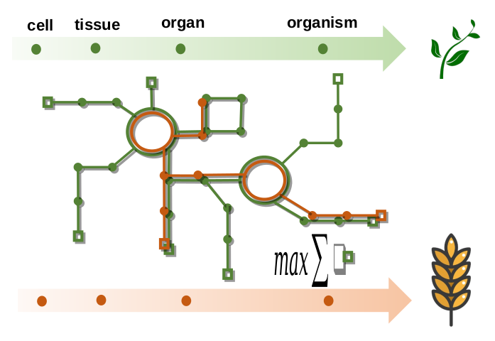

	

Understanding organismal diversity is a major goal of biology. 
This includes both the evolutionary question of how the genetic variation that results 
in different phenotypes arises and is maintained, and the systems biology question of 
how a given genotype translates into a corresponding phenotype. Evolutionary biology 
focuses on understanding how heritable traits change in populations due to mutation, 
natural selection, drift and migration. Systems biology is based on the interdisciplinary 
study of interactions of cellular components within biological systems, leading to emergent 
properties across levels of cellular organization (e.g. cells, tissues, organisms). 
Importantly, both disciplines aim to uncover the genetic and molecular basis of phenotypes, 
albeit at different scales: Evolutionary biology deals with populations of genotypes over several generation, 
while systems biology is largely focused on phenotypes over the lifespan of a single individual. 
Conceptually, both disciplines are linked by a focus on the entire phenotype of organisms. 
As this is the target of natural selection, the entire phenotype is at the core of evolutionary theory, 
and understanding the interacting processes leading to a particular entire phenotype is
the key goal of systems biology. Another similarity is that both disciplines are firmly 
grounded in mathematical modelling and development of theories, resulting in powerful 
computational approaches in both areas. These computational approaches use the plethora 
of data obtained from genotyping technologies, to survey genetic variation, and various 
molecular and cellular profiling technologies, to monitor the diverse cellular components.
In this sense, both disciplines have greatly benefited from decades of research in model 
organisms, with a growing interest in transfer of approaches and knowledge to non-model and 
agronomically or industrially relevant species. Both of these fields have up to now been 
represented by uFSPs at the University of Potsdam, i.e. ‘Functional Ecology and Evolution’ 
and ‘Plant Genomics and Systems Biology’.
This is a new uFSP at the interface between these previous focus
areas in the emerging field of ‘Evolutionary Systems Biology’. The overarching goal of this research 
field is to bring concepts and techniques of systems biology to bear on evolutionary questions 
and at the same time to propel further developments in systems biology by appropriating quantitative 
approaches from evolutionary genetics. 

	

## News
The page has been started!

## Acknowledgement

